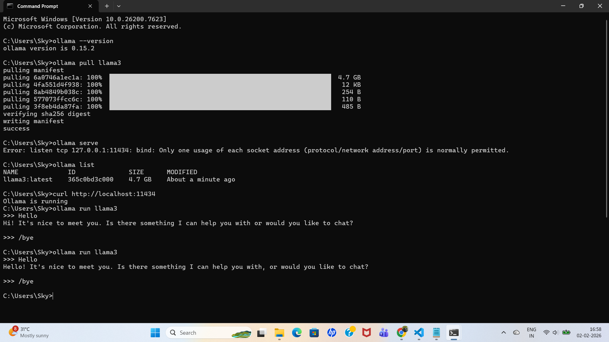
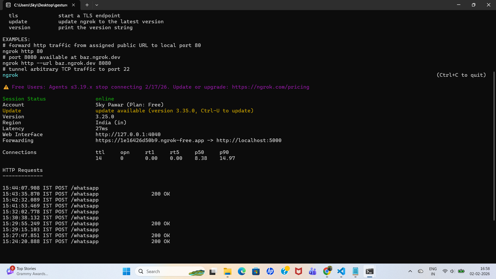
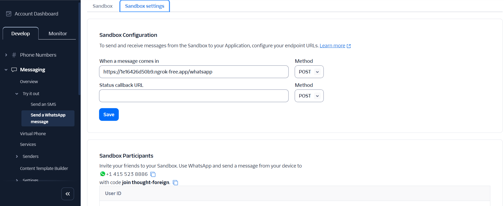

# AI WhatsApp & Email Automation System

A complete **AI-powered WhatsApp automation and admin dashboard system** built using **Python, Flask, Twilio WhatsApp API, ngrok, and Ollama (local LLM)**.

This project supports:
- Real-time WhatsApp AI auto-replies
- Admin dashboard with live chat
- Manual admin replies to WhatsApp users
- Local AI (no paid API, no rate limits)
- Secure environment variable handling

---

## 🚀 Features

- 🤖 AI-based WhatsApp auto replies (local LLM via Ollama)
- 💬 Admin dashboard with two-way chat
- 🧑‍💼 Manual admin replies sent to real WhatsApp users
- 📜 Conversation logging
- 🔒 No API keys exposed on GitHub
- 💸 Zero AI cost (runs locally)

---

## 🛠 Tech Stack

- **Backend:** Python, Flask  
- **AI:** Ollama (llama3 model – local LLM)  
- **Messaging:** Twilio WhatsApp API  
- **Tunneling:** ngrok  
- **Frontend:** HTML, CSS (Flask Jinja templates)

---

````md
## 📁 Project Structure

```text
ai-automation/
├── admin/
│   └── dashboard.py
│
├── whatsapp/
│   └── webhook.py
│
├── ai/
│   └── reply_generator.py
│
├── templates/
│   ├── base.html
│   └── dashboard.html
│
├── static/
│   └── css/
│       └── style.css
│
├── logs/
│   └── messages.log
│
├── config.py
├── .env.example
├── .gitignore
├── requirements.txt
└── README.md
```
```


---

## 🔐 Environment Variables Setup (IMPORTANT)

Create a `.env` file in project root (this file is **NOT pushed to GitHub**):

```env
EMAIL_ID=your_email@gmail.com
EMAIL_PASSWORD=your_email_password

TWILIO_SID=ACxxxxxxxxxxxxxxxx
TWILIO_AUTH=xxxxxxxxxxxxxxxx
WHATSAPP_FROM=whatsapp:+14155238886
```
---

## 🤖 Ollama (Local AI) Setup

This project uses Ollama to run AI locally (no OpenAI / paid APIs).

1️⃣ Install Ollama
Download from:
👉 https://ollama.com

- Restart your system after installation.

2️⃣ Verify Ollama Installation
-> ollama --version

Expected output:
-> ollama version x.x.x

3️⃣ Download AI Model (llama3)
-> ollama pull llama3

This downloads ~4.7GB model (one time only).

4️⃣ Verify Ollama is Running
-> ollama list

Expected:
- llama3:latest

Test locally:
- ollama run llama3

Type:
- Hello



* If AI replies → Ollama is working.

---

## 🌐 ngrok Setup (Expose Local Server)

- ngrok is used to expose your local Flask server to the internet so Twilio can reach it.

1️⃣ Start Flask Server

From project root:
- python -m whatsapp.webhook

Flask runs on:
- http://127.0.0.1:5000

2️⃣ Start ngrok Tunnel
In a new terminal:
- ngrok http 5000

You will see output like:
- Forwarding https://xxxx.ngrok-free.app -> http://localhost:5000



✅ Copy the https ngrok URL
Example:
- https://1e16426d50b9.ngrok-free.app

--- 

## 📲 Twilio WhatsApp Configuration

1️⃣ Open Twilio Console
👉 https://console.twilio.com

Go to:
- Messaging → Try it out → Send a WhatsApp message → Sandbox settings

2️⃣ Configure Webhook URL

In “When a message comes in”, set:
https://<ngrok-url>/whatsapp

Example:
https://1e16426d50b9.ngrok-free.app/whatsapp

Method: POST
Click Save

3️⃣ Join WhatsApp Sandbox

From your personal WhatsApp, send:
join <your-code>



To the Twilio sandbox number:
+1 415 523 8886
(One-time step)

### 👨‍💻 Author
Sky Pawar - Software Developer